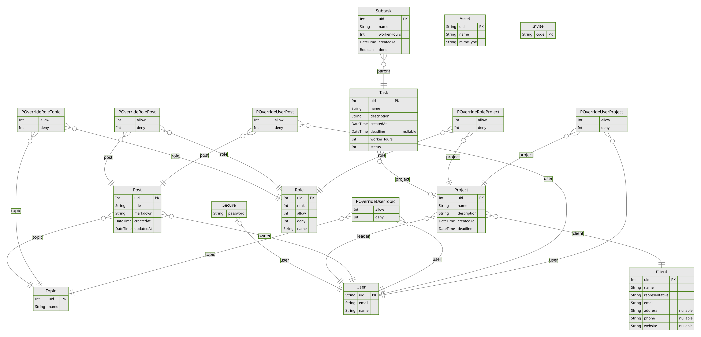

<!--

To compile: pandoc report.md -o report.pdf

https://pandoc.org/installing.html

winget or apt or whatever also have it iirc

-->

<!--Todo
~~weekly meetings~~
~~WhatsApp communcation usage~~
comments
~~github projects and issues~~
link everthing to requirements where appropriate
design and implementation are 70% of the marks
10% for referencing
20% for organisation and presentation
-->

# System Design

Our [solution stack](https://en.wikipedia.org/wiki/Solution_stack) consists of: [Vue.js](https://vuejs.org/)^[<https://vuejs.org/>], a client-side reactivity framework; [Nuxt.js](https://nuxt.com/)^[<https://nuxt.com/>], a Vue framework for universal applications; and [Prisma](https://www.prisma.io/)^[<https://www.prisma.io/>], a database ORM.
Every component of this stack supports [TypeScript](https://www.typescriptlang.org/)^[<https://www.typescriptlang.org/>] (TS) which became our language of choice.
This provides type safety in all aspects of our code and requires the team to be proficient in only a single language, making it simpler to share and reuse code as a small team.
Finally, being a TypeScript solution, the server uses [Node.js](https://nodejs.org/)^[<https://nodejs.org/>] for the JavaScript runtime.

## Vue

Vue.js is a JavaScript framework for building reactive single-page applications (SPA).
Vue uses composition with reusable, reactive components.
The reactive data-binding system handles updating the DOM whenever the underlying data changes, making development much simpler.
Single File Components (SFCs) are self containted units of the HTML, TS, and CSS which handle both the logic and the rendering.
This gave us an intuitive way of diving up tasks between the team, as everyone could work on an individual components and then the functionality reused by another.

Additionally, Vue works well with several build tools such as CSS pre-processors, enabling us to easily use SCSS, making it easier to write and maintain styles for the application.

The nature of single-page applications provide fast transitions between pages as well as reducing the load on the server.
The downside of this is a long initial loadtime as the client downloads and executes all of the JavaScript to build the DOM. We solved this by introducing [Nuxt](#nuxt).

## Nuxt

Nuxt.js is a meta-framework built on top of [Vue](#vue) which introduces: powerful and flexible file-based routing, RESTful api routes, and server-side rendering (SSR) to improve performance.

Initially, the biggest help provided by Nuxt in our project was the provision of a structured filing system which split up the system's pages, components and assets, among other things, which allowed us as a development team to find and manage the code much more efficiently.

All these libraries assisted in meeting the requirements in many different aspects.
We were able to easily produce a responsive design[^req-13] and make elements reactive to provide up to date and accurate information, for example the kanban board[^req-06], just to name a few of the requirements hit due to these libraries.

## Prisma and database design

<!-- Talk about Prisma in more detail.
  How did we use Prisma in our system?
   What were the benefits provided to our system?
   Also need to talk about database design.
   Why is the database designed the way it is?
   Are there any limitations to the design?
   How does the database design allow us to meet the requirements?
   A graphic for the database design might be nice.-->

As per the specification, a MySQL database has been used to store and interact with data needed for usage of the system.
We decided to streamline this by using Prisma, an ORM (Object Relational Mapper) to manage and interact with the database.
**as discussed in...** <!--TODO - find where they said this was OK-->

First off, we needed to create a database design.
This was done in a team meeting where we outlined the tables needed, primary keys for each and then any additional tables that were needed to follow data normalization.
During this meeting we produced schema.md[^schema], a markdown file which contains the plan for the database.
This was mostly followed in the final production of the database, with the addition of some other tables needed after clarification of requirements (such as the roles-based permission system).

Now that the initial draft of the database design was complete, we needed to produce the tables and implement data.
Prisma offers a Schema Definition Language (SDL) which is a high level language which defines a simple way to define the structure of the database.
The database is defined in schema.prisma[^prisma-schema], which defines all the tables, their contents and data types and additional fields, for example the user id must be unique.

The use of prisma also integrated well with the use of TypeScript, as it allowed for database queries to be written out in TypeScript instead of SQL, which provides type-safety and increases security by removing the risk of SQL injection attacks on the website.
This allowed the more efficient creation of database calls.

Testing was also a task that prisma aided.
Normally to test the website and the database calls, we would need to run the VM (Virtual Machine) on the GCP (Google Cloud Platform).
This is time consuming and every change we do requires the server to be updated accordingly.
Prisma allowed us to generate a small client database which meant we were able to test database calls within our own computers.
Efficiency was greatly improved due to this feature as we were able to design, build and test all in one go, without unnecessary time spent uploading the changes to the VM.

For example, the knowledge management system uses a large amount of database calls to collect all the nessesary information[^req-11].
Prisma not only streamlined development but also the testing, as it allowed quick client side database calls to test the array of features such as the post searching function.

See the image below for the database ERD (Entity Relationship Diagram):

\

<!--can include and image of the database design from the initial draft, not sure where it is however-->

## GUI (Graphical user interface) design

<!-- Talk about the user interface design.
      Why is it designed in the way that it is (e.g., colour scheme, layout, navigation etc.)?
      How does it meet the requirements?  -->

The GUI (graphical user interface) was designed to meet the clients.
In this light, the system prominently features the Make-It-All Brand colours.
Furthermore, many interface design decisions have been made after conversations on the online forums.
For example, the Kanban style of displaying tasks was a requirement set out by the client which influenced the way that the UI (user interface) was designed.
The UI is designed with usability and accessibility in mind, with tools such as Google's Lighthouse auditing system used to ensure accessibility and reference of A11y^[<https://www.a11yproject.com/>] to ensure compatibility with assistive technologies as much as possible.

Here are the guiding principles which were kept in consideration when completing the design of the system:

- A colour scheme which is easy to read (a strong contrast in colour between the background colour and the text, a font which is readable and colours which are still readable for people with colour blindness).
  This helps make the system easier and faster to use.
- A simple UI which isn’t overcrowded and is easy to follow.
  This helps the usability of the system as it means that no negative functionality is provided to the user (negative functionality is functionality which takes away from the user experience – putting the system further away from the user’s needs).
  The importance of a simple UI is reiterated by the requirements from the client (through the online forums).
- Careful attention paid to the default options which the UI incorporates (e.g., defaulting the knowledge management search function to search for all topics). By using common default options, the system can become more efficient and save the user time.
- A consistent design throughout the whole system.
  Consistency in design helps the user feel more familiar with the system and makes the software more intuitive to new users.

## Changes from prototype

<!-- Talk about feedback given and reasons for implementing these changes.
     How will they affect the system
     Mention that by implementing this feedback, the requirements will be better met.-->

During our presentation to the clients, we received feedback on how our prototype could be improved to better meet the requirements.
In order to make a better system for the client, we have implemented the majority of their feedback.
See table 1 for details.

(Table 1)

| System page          | Feedback                                                                                                                     | Implemented (Yes/No) |
| -------------------- | ---------------------------------------------------------------------------------------------------------------------------- | -------------------- |
| Dashboard            | Needs to be clear where each task has originated from                                                                        | Yes                  |
| Dashboard            | Team leaders and managers should be part of one or more teams                                                                | Yes                  |
| Dashboard            | Could have functionality to swap between Kanban view and task view                                                           | Yes                  |
| Project              | Calculation of progress should be based on worker-hours of tasks                                                             | Yes                  |
| Project              | The days remaining until the project deadline should exclude holidays and weekends                                           | Yes                  |
| Project              | Should be able to change the team leader of a project                                                                        | Yes                  |
| Project              | Could make use of graphs (e.g., bar chart) to show the allocation of hours, amongst employees, on a project                  | Yes                  |
| Project              | Each task in the tasks section of the page could have an icon(s) to see who is allocated the task                            | Yes                  |
| Project              | Could have functionality to show more information about an employee when their icon is hovered over                          | Yes                  |
| Knowledge management | FAQ page is needed                                                                                                           | Yes                  |
| Knowledge management | Managers should be able to decide on a person-to-person basis; who can create topics and who can create posts within a topic | Yes                  |
| Knowledge management | Functionality to upload images to posts is needed                                                                            | Yes                  |
| Knowledge management | Could search for posts by user                                                                                               | Yes                  |
| Not page specific    | Shouldn’t highlight the navigation button to “view my profile” page when you are viewing someone else’s page                 | Yes                  |
| Not page specific    | The navigation bar could show text on hover                                                                                  | Yes                  |

# System Implementation

## Planning and prioritisation of tasks

<!-- Talk about Github Kanban board (potentially add a screenshot of it?).
How did it make us more productive? How did it help us prioritise our work?-->

To implement the system, we first broke the design down into much smaller tasks.
We then needed a method to keep track of the implementation of these tasks.
In order to implement the system in the most efficient manner, we used a Kanban board of our own on GitHub.
Therefore, we could plan the order of the tasks which would be completed and the priority of each task.
The Kanban board also allowed us to assign each task to a team member and track the progression of each task.
This form of productivity management allowed us to build the software in a systematic manner and ensured that we didn’t forget any tasks.

## Communication

Throughout the development process we were in constant communication with each-other: weekly meetings, a centralised group chat, GitHub Issues[^gh-issues] and informally throughout the week were all useful means of communication.

During the weekly meetings, we discussed progress, and addressed issues that had come up throughout the week's development.
These meetings also included the initial discussions of what libraries we were going to use including the use of TypeScript and SASS, database design and other decisions we needed to make before development.
Group tasks were also undertaken for example, creating and configuring the server on GCP, as well as the task allocation for the next week.

Online communication, including a group chat, proved to be very useful, as we were able to discuss issues and ask for any help where needed.
Efficiency was the key takeaway from this, as minor issues could be solved without the need for a meeting which meant the weekly meetings were kept on topic and not spent discussing small bugs and errors.

## Prototyping

Before the development process of the system, a throw-away prototype was created to explore the requirements and interface ideas for the client.
This was beneficial for managing the client's expectations and ensuring that their needs and wants were clear before investing time.

The only changes made to the design and proposed functionality of the system were based on feedback of the prototype from the client.

After the client had seen the prototype and given feedback, the prototype was referenced throughout the development process as a part of the interface design.
Development of the final system was then started with the feedback of the client to aid the final systems design and functionality.

## Documentation

<!-- Breifly talk about the need for documentation for maintance and future development. Describe the process of debugging. Go into more detail with the testing section. Can also mention that some bugs may remain due to the time limit/ economic reasons (if it was the real world). How did these tools allow us to meet the requirements? Talk about lighthouse (link with GUI section - testing usability)?-->

Documentation is extremely important.
Effective documentation of the code will make the system easier to maintain and update as it makes the code human-readable.
It allows other developers, in the future, to read and understand the current code, which allows them to fix bugs and add more functionality.
Even if the developers employed to maintain/update the code in the future are the same developers who wrote the code, they may have forgotten how the code works.
Therefore, good documentation is always important.

The client has given multiple indications throughout communications that they will likely wish to add more functionality to the system further down the line.
This would only prove feasible if the code has been documented well.

<!--might write something about comments here as documentation-->

Documentation has also been used for the project as a whole.
Throughout the project, we have ensured to document the requirements precisely.
Our requirements document gave us a clear focus for our development – with “must”, “should” and “could” requirements allowing us to rank the importance of each requirement[^requirements].
We also documented the whole project through GitHub.
GitHub gave us version control for our system’s development.
Each change which was made to the project was pushed to the repository as a commit.
Each commit had a commit message, making it easy to go back and see where each individual change was made.
Documentation has also been used for the project as a whole.
Throughout the project, we have ensured to document the requirements precisely.
Our requirements document gave us a clear focus for our development – with “must”, “should” and “could” requirements allowing us to rank the importance of each requirement[^requirements].
We also documented the whole project through GitHub.
GitHub gave us version control for our system’s development.
Each change which was made to the project was pushed to the repository as a commit.
Each commit had a commit message, making it easy to go back and see where each individual change was made.

## Debugging

The version control mentioned above made debugging much simpler.
Anytime a bug was found with a particular component, the commit history could be used to see the recent changes made to said component.
Usually, the bug lay within one of the recent commits.
Debugging is a useful tool which we utilised thoroughly throughout the development of our system.
It’s important to note that some bugs will always remain.
There comes a point in any project where it is no longer feasible nor cost effective to keep finding and fixing bugs.
The version control mentioned above made debugging much simpler.
Anytime a bug was found with a particular component, the commit history could be used to see the recent changes made to said component.
Usually, the bug lay within one of the recent commits.
Debugging is a useful tool which we utilised thoroughly throughout the development of our system.
It’s important to note that some bugs will always remain.
There comes a point in any project where it is no longer feasible nor cost effective to keep finding and fixing bugs.

Throughout development, we adopted a static software inspection approach to debugging.
A static software inspection is essentially where developers look at code and try to find bugs in it.
This was extremely beneficial to the project as it allowed us to implement debugging at all stages of the development/design and added very little time/monetary cost.
By using static software inspection, we avoided many bugs which ultimately saved us (and the client) time.
Throughout development, we adopted a static software inspection approach to debugging.
A static software inspection is essentially where developers look at code and try to find bugs in it.
This was extremely beneficial to the project as it allowed us to implement debugging at all stages of the development/design and added very little time/monetary cost.
By using static software inspection, we avoided many bugs which ultimately saved us (and the client) time.

<!--realised static inspection is a debugging method and not a testing method-->

## Testing

Throughout the implementation of the system, testing was used to ensure that the requirements of the client had been satisfied.
Our throw-away prototype helped us to test the software.
By presenting a prototype to the client, the client could find errors in the software which we (as developers) perhaps hadn’t noticed.
Throughout the implementation of the system, testing was used to ensure that the requirements of the client had been satisfied.
Our throw-away prototype helped us to test the software.
By presenting a prototype to the client, the client could find errors in the software which we (as developers) perhaps hadn’t noticed.

During development we also tested all functionality when it was first added to the system.
Before any code was committed, it was tested for functionality and bugs to ensure the development was sucessful and efficient.
In case any bugs were commited, these would be discovered through static inspection and practial testing once major functionaility was introduced.
During development we also tested all functionality when it was first added to the system.
Before any code was committed, it was tested for functionality and bugs to ensure the development was sucessful and efficient.
In case any bugs were commited, these would be discovered through static inspection and practial testing once major functionaility was introduced.

For example, once the project page was produced, it was inspected and then practially tested against the requirements[^req-08].
Then any issues were mentioned in the group chat or Github issue page and the commit was identified and the bug was fixed.
For example, once the project page was produced, it was inspected and then practially tested against the requirements[^req-08].
Then any issues were mentioned in the group chat or Github issue page and the commit was identified and the bug was fixed.

[^gh-issues]: Our GitHub issue tracking: <https://github.com/orgs/lborocs/projects/1/>
[^req-01]: From Requirement 01: - see: <https://github.com/lborocs/22cob290-part2-team-07/blob/c22f46646d2b36164cfe99995cd2b95a588e43dd/design/requirements.md#1-log-in--registration-requirements>
[^req-02]: From Requirement 02: - see: <https://github.com/lborocs/22cob290-part2-team-07/blob/c22f46646d2b36164cfe99995cd2b95a588e43dd/design/requirements.md#2-registration-page-requirements--registration-requirements>
[^req-03]: From Requirement 03: - see: <https://github.com/lborocs/22cob290-part2-team-07/blob/c22f46646d2b36164cfe99995cd2b95a588e43dd/design/requirements.md#3-user-requirements>
[^req-04]: From Requirement 04: - see: <https://github.com/lborocs/22cob290-part2-team-07/blob/c22f46646d2b36164cfe99995cd2b95a588e43dd/design/requirements.md#4-team-leader-requirements>
[^req-05]: From Requirement 05: - see: <https://github.com/lborocs/22cob290-part2-team-07/blob/c22f46646d2b36164cfe99995cd2b95a588e43dd/design/requirements.md#5-project-manager-requirements>
[^req-06]: From Requirement 06: - see: <https://github.com/lborocs/22cob290-part2-team-07/blob/c22f46646d2b36164cfe99995cd2b95a588e43dd/design/requirements.md#6-productivity-management-requirements>
[^req-07]: From Requirement 07: - see: <https://github.com/lborocs/22cob290-part2-team-07/blob/c22f46646d2b36164cfe99995cd2b95a588e43dd/design/requirements.md#7-task-requirements>
[^req-08]: From Requirement 08: - see: <https://github.com/lborocs/22cob290-part2-team-07/blob/c22f46646d2b36164cfe99995cd2b95a588e43dd/design/requirements.md#8-project-requirements>
[^req-09]: From Requirement 09: - see: <https://github.com/lborocs/22cob290-part2-team-07/blob/c22f46646d2b36164cfe99995cd2b95a588e43dd/design/requirements.md#9-project-manager>
[^req-10]: From Requirement 10: - see: <https://github.com/lborocs/22cob290-part2-team-07/blob/c22f46646d2b36164cfe99995cd2b95a588e43dd/design/requirements.md#10-manager-dashboard-requirements>
[^req-11]: From Requirement 11: - see: <https://github.com/lborocs/22cob290-part2-team-07/blob/c22f46646d2b36164cfe99995cd2b95a588e43dd/design/requirements.md#11-knowledge-management-requirements>
[^req-12]: From Requirement 12: - see: <https://github.com/lborocs/22cob290-part2-team-07/blob/c22f46646d2b36164cfe99995cd2b95a588e43dd/design/requirements.md#12-client-requirements>
[^req-13]: From Requirement 13 - see: <https://github.com/lborocs/22cob290-part2-team-07/blob/c22f46646d2b36164cfe99995cd2b95a588e43dd/design/requirements.md#13-system-requirements>
[^schema]: Database Design file : <https://github.com/lborocs/22cob290-part2-team-07/blob/main/design/schema.md>
[^prisma-schema]: Prisma Schema file: <https://github.com/lborocs/22cob290-part2-team-07/blob/main/prisma/schema.prisma>
[^requirements]: Requirements document: <https://github.com/lborocs/22cob290-part2-team-07/blob/main/design/requirements.md>
