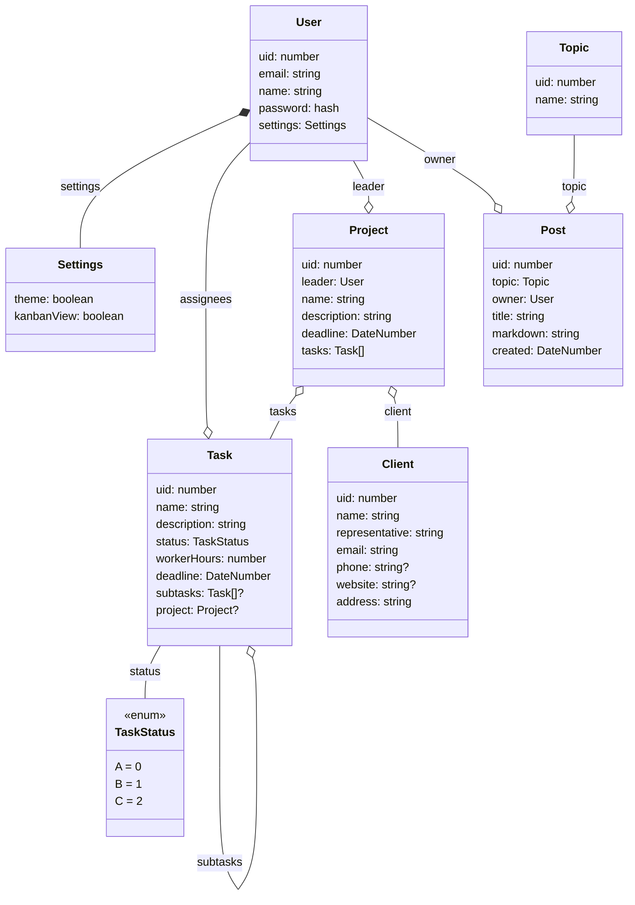

```mermaid
classDiagram
direction TB

User *-- Settings: settings
User --o Task: assignees
Task -- TaskStatus: status
Task --o Task: subtasks
Project o-- Task: tasks
Project o-- Client: client
User --o Project: leader
User --o Post: owner
Topic --o Post: topic

class User {
	uid: number
	email: string
	name: string
	password: hash
	settings: Settings
}

class Task {
	uid: number
	name: string
	description: string
	status: TaskStatus
	workerHours: number
	deadline: DateNumber
	subtasks: Task[]?
	project: Project?
}

class TaskStatus {
	<<enum>>
	A = 0
	B = 1
	C = 2
}

class Project {
	uid: number
	leader: User
	name: string
	description: string
	deadline: DateNumber
	tasks: Task[]
}

class Client {
	uid: number
	name: string
	representative: string
	email: string
	phone: string?
	website: string?
	address: string
}

class Topic {
	uid: number
	name: string
}

class Post {
	uid: number
	topic: Topic
	owner: User
	title: string
	markdown: string
	created: DateNumber
}

class Settings {
	theme: boolean
	kanbanView: boolean
}
```
