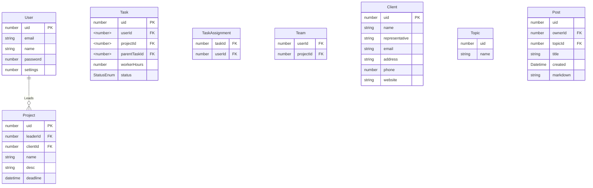

Permissions {
	create topics.
	who can post in said topic.
	who can edit an existing post.
	who can edit permissions of users.
	who can access the manager dashboard.
	who can assign people to a task.
	who can create a project.
	who can create a client.
	create a task (in a project).
	who can invite a user to a system???
	who can see a post.
}
see all posts by a certain user
